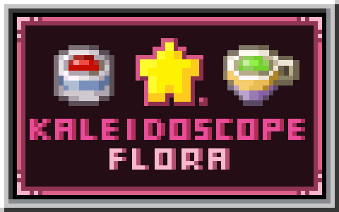

# Kaleidoscope Flora

Brew drinks from flowers, and let every flower have a flavor of its own.

An addon for [Kaleidoscope Cookery](https://modrinth.com/mod/kaleidoscope-cookery) that turns vanilla flowers into a full brewing experience.

## Gameplay

Gather flowers, brew them in the stockpot, drink and gain the flower's blessing.

- **26 flower drinks** - each with its own recipe, effect, and a flower-language quote
- **One pot yields 9 cups** - ladle them out with Cookery's empty teacups
- **Signature effects** - walk on water, glow through the night, dig up artifacts with a sniffer's instincts, and more
- **15 advancements**

## Requirements

| Dependency | Version | Required |
|---|---|---|
| Minecraft | 1.21.1 | Yes |
| NeoForge | 21.1.248 | Yes |
| [Kaleidoscope Cookery](https://modrinth.com/mod/kaleidoscope-cookery) | 1.4.1 | Yes |
| [Sodium Dynamic Lights](https://modrinth.com/mod/sodium-dynamic-lights) | 1.0.10 | No (full glow effect at night) |
| [Vanilla Backport](https://modrinth.com/mod/vanillabackport) | - | No (unlocks 4 crossover drinks brewed from 1.21.4+ flowers) |

## Download

Grab the latest jar from [Releases](https://github.com/Rlosking-C/kaleidoscope-flora/releases) and drop it into your `mods` folder.

**Status**: feature complete. All 26 drinks, effects and artwork are in - see the roadmap below for what comes next.

## Roadmap

- **v0.2.0**
  - 26 flower drinks: recipes, effects, item/cup/teapot textures, stockpot surface animations
  - 23 custom effects (auras, gaze, sniffer-dig archaeology, water-walking, drop magnet, and more)
  - VanillaBackport crossover: 4 bonus drinks with 1.21.4+ flowers (recipes and drinks both gated cleanly)
  - 15 advancements
  - Rosy Stride reworked into true surface physics - smooth boarding of banks and shores
- **v0.3.0** (current)
  - Server config: effect duration multiplier, aura range multiplier, vampiric heal percent, harvest drop cap
  - JEI info pages for every drink (maxim + effect description)
- **Next**
  - Balance pass from first player feedback (drop rates, aura ranges, cooldowns)
  - Golden dandelion port; As-You-Wish swaps back from gold nuggets once it lands
  - Teacup texture polish pass
- **Later / exploratory**
  - Considered, not promised: additional drink families (herbal? mushroom?), EMI recipe viewing for the stockpot, localizations beyond en/zh

## License

- Code: [MIT](LICENSE)
- Art assets: [CC BY-NC-SA 4.0](https://creativecommons.org/licenses/by-nc-sa/4.0/)

## Porting & forks

Yes, you may port this mod - both the license and the author are fine with it:

- **Code is MIT**: port, modify, and redistribute freely; just keep the copyright notice.
- **Art is CC BY-NC-SA 4.0**: reuse requires credit and non-commercial use; adaptations must use the same license. If you would rather not carry those terms, redraw the textures.
- **Porting targets**: a Forge 1.20.1 port is welcome. Mind the two hard dependencies on modern APIs - Cookery's `TeacupRegistry` push-registration (runs in the mod constructor) and NeoForge's damage pipeline (`LivingIncomingDamageEvent` / `LivingDamageEvent.Pre`); both need Forge-era equivalents (RegistryObject flow / `LivingHurtEvent` + `LivingDamageEvent`).
- Please open an issue or ping the author so the port can be linked from this README.

## Credits

- [Kaleidoscope Cookery](https://modrinth.com/mod/kaleidoscope-cookery) - upstream mod and required dependency

Another mod by the same author: [Create: Colored Connections](https://www.curseforge.com/minecraft/mc-mods/create-colored-connections)
